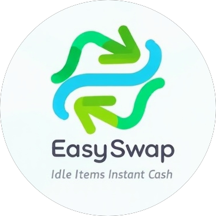

# EasySwap - Peer-to-Peer Trading Platform

<div align="center">
  
  
  [](https://www.easyswap.shop)
  [](https://x.com/EasySwap_xyz)
  [](https://github.com/EasySwapxyz/EasySwap)
</div>

## Overview

EasySwap revolutionizes peer-to-peer trading of second-hand items through an AI-powered, secure, and user-friendly platform. Our solution combines advanced technology with intuitive design to create a seamless trading experience.

### Key Features

- **Smart Item Listing**: AI-powered item recognition and pricing suggestions
- **Secure Trading**: Escrow system for safe transactions
- **Community Engagement**: Social features and user reputation system
- **Location-Based**: Prioritize local trades to reduce logistics costs
- **AR Integration**: Virtual try-on for clothes and furniture placement preview
- **Token Economy**: EasySwap Token (EET) for platform incentives and services

## System Architecture

Our platform follows a microservices architecture with the following key components:

### Client Layer
- Mobile App (React Native)
- Web App (Next.js)
- Admin Portal (React)

### API Gateway
- Authentication & Authorization
- Rate Limiting
- Request Routing
- API Documentation

### Service Layer
- User Service
- Product Service
- Transaction Service
- Chat Service
- Search Service
- AI Service
- Notification Service

### Data Layer
- PostgreSQL (Primary Database)
- Redis (Caching)
- MinIO (File Storage)
- Elasticsearch (Search Engine)

## Technical Implementation

### Frontend Architecture
- React Native for mobile app
- Next.js for web app
- React for admin portal
- Redux Toolkit for state management
- Material-UI and React Native Paper for UI
- React Query for data fetching
- Socket.IO for real-time features

### Backend Architecture
- Node.js with NestJS framework
- TypeScript for type safety
- JWT authentication
- WebSocket support
- GraphQL API (optional)
- Microservices communication

### Data Flow
1. Client request through API Gateway
2. Authentication and rate limiting
3. Request routing to appropriate service
4. Business logic processing
5. Data storage/retrieval
6. Response back to client

### Security Implementation
- JWT-based authentication
- Role-based access control
- Request validation
- Rate limiting
- Data encryption
- Secure WebSocket connections

## Directory Structure

```
easyswap/
├── apps/                      # Client applications
│   ├── mobile/               # React Native mobile app
│   │   └── src/
│   │       ├── components/   # Reusable UI components
│   │       ├── hooks/        # Custom React hooks
│   │       ├── store/        # Redux store configuration
│   │       └── utils/        # Utility functions
│   ├── web/                  # Next.js web app
│   │   └── src/
│   │       ├── components/   # Reusable UI components
│   │       ├── hooks/        # Custom React hooks
│   │       ├── store/        # Redux store configuration
│   │       └── utils/        # Utility functions
│   └── admin/                # React admin portal
│       └── src/
│           ├── components/   # Reusable UI components
│           ├── hooks/        # Custom React hooks
│           ├── store/        # Redux store configuration
│           └── utils/        # Utility functions
├── backend/                  # NestJS backend
│   ├── src/
│   │   ├── controllers/     # API endpoints
│   │   ├── services/        # Business logic
│   │   ├── models/          # Data models
│   │   ├── middleware/      # Custom middleware
│   │   └── utils/           # Utility functions
│   └── tests/               # Backend tests
├── shared/                  # Shared code
│   ├── constants/          # Shared constants
│   ├── interfaces/         # TypeScript interfaces
│   └── utils/              # Shared utilities
├── docs/                   # Documentation
│   ├── api/               # API documentation
│   ├── contracts/         # Smart contract docs
│   └── en/               # English documentation
└── scripts/              # Utility scripts
    ├── deployment/      # Deployment scripts
    └── development/    # Development tools
```

## Getting Started

### Prerequisites
- Node.js (v18+)
- Docker
- PostgreSQL (v15+)
- Redis (v7+)

### Installation
```bash
# Clone the repository
git clone https://github.com/EasySwapxyz/EasySwap.git
cd EasySwap

# Install dependencies
npm install

# Set up environment
cp .env.example .env

# Start services
docker-compose up -d

# Start development
npm run dev
```

## Contributing

Please read our [Contributing Guidelines](CONTRIBUTING.md) for details on our code of conduct and the process for submitting pull requests.

## License

This project is licensed under the MIT License - see the [LICENSE](LICENSE) file for details.

## Contact

- Website: [easyswap.shop](https://www.easyswap.shop)
- Twitter: [@EasySwap_xyz](https://x.com/EasySwap_xyz)

Built with ❤️ by the EasySwap Team 